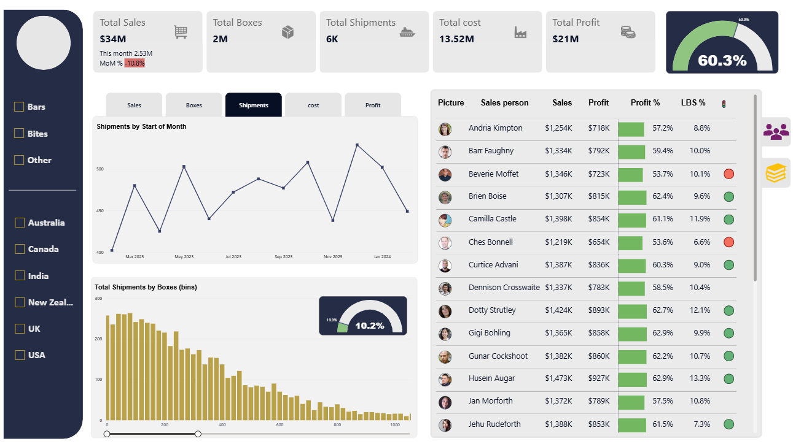

# Sales-Data-Analytics

# 📊 Business Performance & Sales Analytics Dashboard

An interactive Power BI dashboard built to analyze sales, profitability, operational costs, and business performance using 6K+ sales records. 
- The project provides KPI tracking and actionable insights to support data-driven decision-making.

## 🎯 Objective
  To develop a BI dashboard that enables stakeholders to monitor sales performance, profitability, operational costs, and 
  Month-over-Month business trends.

## 🛠️ Tech Stack
- Power BI
- DAX
- Power Query

## 📈 Features
  - Interactive KPI Dashboard
  - Sales & Profit Analysis
  - Month-over-Month (MoM) Analysis
  - Regional & Salesperson Performance
  - Shipment & Cost Analysis
  - Dynamic Filters & Slicers
  - 15+ DAX Measures

## 💡 Key Insights
 - Sales growth did not always translate into higher profitability.
 - Regional and salesperson performance varied across the business.
 - MoM analysis helped identify changing business trends.

## 🚀 Dashboard Preview

  

## 📷 Shipments by Geo Tooltip

  

## 📷 Product & Sales person details using Bookmarks

  

 
